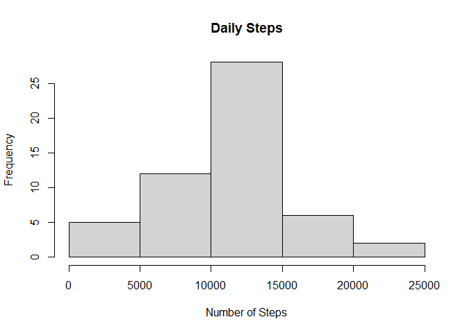
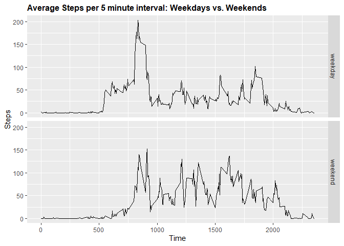

Coursera Reproducible Research Project 1
================
Skylar Trigueiro
January 7, 2021

## Data

``` r
library(dplyr)
```

    ## 
    ## Attaching package: 'dplyr'

    ## The following objects are masked from 'package:stats':
    ## 
    ##     filter, lag

    ## The following objects are masked from 'package:base':
    ## 
    ##     intersect, setdiff, setequal, union

``` r
data <- read.csv("activity.csv", header = TRUE)
head(data)
```

    ##   steps       date interval
    ## 1    NA 2012-10-01        0
    ## 2    NA 2012-10-01        5
    ## 3    NA 2012-10-01       10
    ## 4    NA 2012-10-01       15
    ## 5    NA 2012-10-01       20
    ## 6    NA 2012-10-01       25

# Questions:

## What is mean total number of steps taken per day?

For this part of the assignment, you can ignore the missing values in the dataset.

1.  **Calculate the total number of steps taken per day**
2.  **If you do not understand the difference between a histogram and a barplot, research the difference between them. Make a histogram of the total number of steps taken each day**
3.  **Calculate and report the mean and median of the total number of steps taken per day**

The following code counts the total number of steps taken each day:

``` r
dailySteps <- tapply(data$steps, data$date, sum)
dailySteps
```

    ## 2012-10-01 2012-10-02 2012-10-03 2012-10-04 2012-10-05 2012-10-06 2012-10-07 
    ##         NA        126      11352      12116      13294      15420      11015 
    ## 2012-10-08 2012-10-09 2012-10-10 2012-10-11 2012-10-12 2012-10-13 2012-10-14 
    ##         NA      12811       9900      10304      17382      12426      15098 
    ## 2012-10-15 2012-10-16 2012-10-17 2012-10-18 2012-10-19 2012-10-20 2012-10-21 
    ##      10139      15084      13452      10056      11829      10395       8821 
    ## 2012-10-22 2012-10-23 2012-10-24 2012-10-25 2012-10-26 2012-10-27 2012-10-28 
    ##      13460       8918       8355       2492       6778      10119      11458 
    ## 2012-10-29 2012-10-30 2012-10-31 2012-11-01 2012-11-02 2012-11-03 2012-11-04 
    ##       5018       9819      15414         NA      10600      10571         NA 
    ## 2012-11-05 2012-11-06 2012-11-07 2012-11-08 2012-11-09 2012-11-10 2012-11-11 
    ##      10439       8334      12883       3219         NA         NA      12608 
    ## 2012-11-12 2012-11-13 2012-11-14 2012-11-15 2012-11-16 2012-11-17 2012-11-18 
    ##      10765       7336         NA         41       5441      14339      15110 
    ## 2012-11-19 2012-11-20 2012-11-21 2012-11-22 2012-11-23 2012-11-24 2012-11-25 
    ##       8841       4472      12787      20427      21194      14478      11834 
    ## 2012-11-26 2012-11-27 2012-11-28 2012-11-29 2012-11-30 
    ##      11162      13646      10183       7047         NA

``` r
hist( dailySteps, xlab = "Number of Steps", main = "Daily Steps")
```



``` r
mean(dailySteps, na.rm=TRUE)
```

    ## [1] 10766.19

``` r
median(dailySteps, na.rm=TRUE)
```

    ## [1] 10765

## What is the average daily activity pattern?

1.  **Make a time series plot (i.e. type = "l") of the 5-minute interval (x-axis) and the average number of steps taken, averaged across all days (y-axis)**
2.  **Which 5-minute interval, on average across all the days in the dataset, contains the maximum number of steps?**

``` r
stepsPerInterval <- aggregate(steps~interval,data=data,FUN=mean,na.action=na.omit)
head(stepsPerInterval)
```

    ##   interval     steps
    ## 1        0 1.7169811
    ## 2        5 0.3396226
    ## 3       10 0.1320755
    ## 4       15 0.1509434
    ## 5       20 0.0754717
    ## 6       25 2.0943396

``` r
plot(stepsPerInterval$interval, 
     stepsPerInterval$steps, 
     xlab = "Interval", 
     ylab = "Steps", 
     main = "Daily Average Activity",
     type = 'l')
```


``` r
temp <- as_tibble(stepsPerInterval)
head(temp)
```

    ## # A tibble: 6 x 2
    ##   interval  steps
    ##      <int>  <dbl>
    ## 1        0 1.72  
    ## 2        5 0.340 
    ## 3       10 0.132 
    ## 4       15 0.151 
    ## 5       20 0.0755
    ## 6       25 2.09

``` r
temp %>% 
  select(interval, steps) %>% 
  filter(steps==max(temp$steps))
```

    ## # A tibble: 1 x 2
    ##   interval steps
    ##      <int> <dbl>
    ## 1      835  206.

The maximum number of steps in a 5 minute interval is in interval 835 with 206 steps

## Imputing missing values

Note that there are a number of days/intervals where there are missing values (coded as NA). The presence of missing days may introduce bias into some calculations or summaries of the data.

1.  **Calculate and report the total number of missing values in the dataset (i.e. the total number of rows with NAs)**
2.  **Devise a strategy for filling in all of the missing values in the dataset. The strategy does not need to be sophisticated. For example, you could use the mean/median for that day, or the mean for that 5-minute interval, etc.**
3.  **Create a new dataset that is equal to the original dataset but with the missing data filled in.**
4.  **Make a histogram of the total number of steps taken each day and Calculate and report the mean and median total number of steps taken per day. Do these values differ from the estimates from the first part of the assignment? What is the impact of imputing missing data on the estimates of the total daily number of steps?**

``` r
sum(is.na(data))
```

    ## [1] 2304

I will be replacing the missing values in the data frame with -99. This way, I can look at a plot of the dataset and visualize where the missing values occur. Since I am only concerned with the location of the missing values and not the properties of the distribution of the data, then this technique should be fine.

``` r
ndata <- as_tibble(data)
ndata$steps <- ifelse(is.na(ndata$steps), -1, ndata$steps)
sum(is.na(ndata))
```

    ## [1] 0

``` r
nDailySteps <- aggregate(ndata$steps, list(ndata$date), FUN=sum)
colnames(nDailySteps) <- c("date", "steps")

hist( nDailySteps$steps, xlab = "Number of Steps", main = "Daily Steps")
```


By design, this imputing technique will alter the distribution. If I was using this for prediction and I believed that the missing value was informative, then I could see myself using this for tree based methods.

``` r
mean(ndata$steps)
```

    ## [1] 32.34882

``` r
median(ndata$steps)
```

    ## [1] 0

As you can see, the the mean and median of the data have drastically changed. Replacing the missing values with an arbitrary value will of course change the distribution of the original data. Depending on your needs this may or may not be effective.

## Are there differences in activity patterns between weekdays and weekends?

For this part the *weekdays()* function may be of some help here. Use the dataset with the filled-in missing values for this part.

1.  **Create a new factor variable in the dataset with two levels - "weekday" and "weekend" indicating whether a given date is a weekday or weekend day.**
2.  **Make a panel plot containing a time series plot (i.e. type = "l") of the 5-minute interval (x-axis) and the average number of steps taken, averaged across all weekday days or weekend days (y-axis). See the README file in the GitHub repository to see an example of what this plot should look like using simulated data.**

``` r
ndata$date <- as.Date(ndata$date, format = "%Y-%m-%d")
ndata$partOfWeek <- weekdays(ndata$date)
ndata$partOfWeek <- ifelse(ndata$partOfWeek=='Saturday' | ndata$partOfWeek=='Sunday', 'weekend','weekday')
head(ndata)
```

    ## # A tibble: 6 x 4
    ##   steps date       interval partOfWeek
    ##   <dbl> <date>        <int> <chr>     
    ## 1    -1 2012-10-01        0 weekday   
    ## 2    -1 2012-10-01        5 weekday   
    ## 3    -1 2012-10-01       10 weekday   
    ## 4    -1 2012-10-01       15 weekday   
    ## 5    -1 2012-10-01       20 weekday   
    ## 6    -1 2012-10-01       25 weekday

``` r
library(ggplot2)
stepsByTimeOfWeek <- aggregate(steps~interval+partOfWeek,
                               data=ndata,
                               FUN=mean)
g <- ggplot(stepsByTimeOfWeek, aes(interval, steps))
g + geom_line() + ggtitle("Average Steps per 5 minute interval: Weekdays vs. Weekends") + xlab("Time") + ylab("Steps")+ theme(plot.title = element_text(face="bold", size=12))+facet_grid(partOfWeek ~ .)
```


